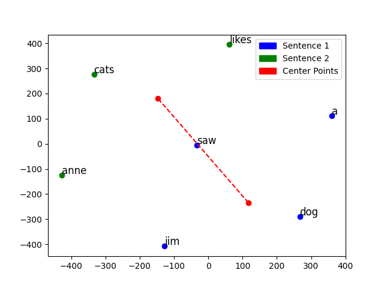
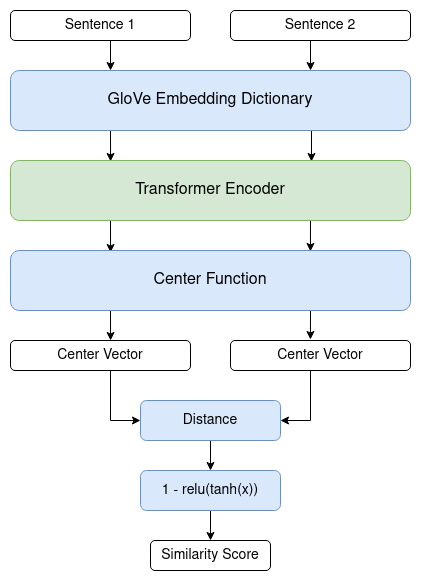

# Semantic Similarity with Distance Between Weighted Embedding-Vector Centers

## Abstract
Semantic similarity for two sentences can be calculated by comparing the distance between the center points of word embeddings. This method has limitations as it is greatly influenced by the types of words chosen, rather than the overall meaning of the sentence. For this experiment, transformer-based self attention was used to modify word embeddings to distinguish sentence meanings as a whole from that of other sentences. The results showed increased efficiency for data similar to the training dataset but poor results for dissimilar data.

## Introduction
A common problem in Natural Language Processing is to determine the closeness of meaning between two words or sentences. For example the sentences “Let’s get lunch” and “How about about we grab a bite to eat?” mean essentially the same things but use entirely different words. Although trivial for a human, machines have great difficulty distinguishing the difference for sentences such as these. A simple solution to this problem would be to use a trained word embedding such as GloVe (Pennington et al, 2014) to map each word into a vector space, then calculate the distance between the center points of the sentences (Fig. 1). The problem with this method is that sentences with the exact same words in a different order will have the same center points, giving them the same similarity score. For example, using this model, “Jim saw the dog” and “The dog saw Jim” would return a result of 100% similar, even though they do not have the same meaning. In an attempt to solve this problem, I modified each word embedding with a transformer-based self attention network to produce more accurate results.

**Figure 1:** Embedding vectors for each word in two different sentences (“jim saw a dog” and “anne likes cats”) with their center points. The red, dotted line shows the distance between their centers, indicating their similarity score.

## Procedures
I started by creating two modules: a dictionary to map words to GloVe embedding vectors and a function to find the center point of the given sentence. I then created a model that takes two sentences and finds each embedding vector using the dictionary then passes them through a transformer encoder. After the vectors have been modified, the center points and the distance between them were calculated. In order to determine the similarity percentages, the distances were passed into the function f(x)=1-max( 0, tanh(x) ). This was used to modify results to be in the range of 0 to 1 and gave smaller distances higher values and vice versa. (Fig. 2)  

The model was trained for 100 epochs on the Text Similarity dataset (Sankineni, 2016). Loss was calculated using Binary Cross Entropy and the Adam optimizer with a learning rate of 10-5 was used for back propagation.

**Figure 2:** Model structure.

## Results and Discussion
Results indicate that using transformers to modify word embeddings increased the average accuracy of the model by almost 60 percent. This was testing on data that is similar to the training dataset. When tested against unfamiliar data, the model was shown to perform rather poorly. For example, inputting the sentence from before yields the same results: “jim saw the dog” and “the dog saw jim” returns 100% similarity. Perhaps if a larger and more varied dataset were used, including more cases of similar but different sentences, accuracy could be increased further. Select results for testing data from the Text Similarity dataset can be found in Table 1.

**Table 1:** Comparison of similarity scores between the simple model using only center distance (Simple Score) and the attention model using transformers (Attention Score). Data is company names from product descriptions taken from the Text Similarity dataset (Sankineni, 2016).

| Sentence 1         | Sentence 2                 | Simple Score (%) | Attention Score (%) |
| :----------------- | :------------------------- | ---------------: | ------------------: |
| semtech corp       | semtech corporation        |             3.61 |               99.86 |
| netflix inc        | netflix inc.               |             2.87 |               99.74 |
| af bond fd amer r6 | the bond fund of america-a |             0.08 |                0.00 |
| vale sa            | vale s a adr               |             0.14 |               83.95 |

## Conclusions
Weighting the vector embeddings of a sentence proved to be an effective means of improving the accuracy of semantic similarity. Although improvements could still be made such as increasing the data quantity and variance. If revisions are made, this model has the potential to be a fast and easily parallelizable solution for semantic similarity problems.

## References
- Jeffrey Pennington, Richard Socher, and Christopher D. Manning. (2014). GloVe: Global Vectors for Word Representation [Data files]. Stanford. Retrieved October 10, 2020, from https://nlp.stanford.edu/projects/glove/
- Sankineni, R. (2016). Text Similarity: Natural Language Processing on Stock Data [Data files]. Kaggle. Retrieved October 10, 2020, from https://www.kaggle.com/rishisankineni/text-similarity

